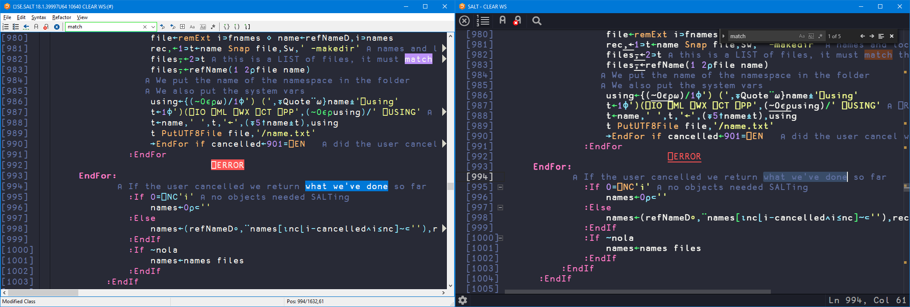

# Dracula for [Dyalog APL Windows IDE](https://dyalog.com/download-zone.htm)

> A dark theme for [Dyalog APL Windows IDE](https://dyalog.com/download-zone.htm).

## Install

All instructions can be found at [draculatheme.com/dyalog-apl-windows-ide](https://draculatheme.com/dyalog-apl-windows-ide).

## Team

This theme is maintained by the following person and a bunch of [awesome contributors](https://github.com/dracula/template/graphs/contributors).

 |
--- |
[Adám Brudzewsky](https://github.com/abrudz) |

## License

[MIT License](./LICENSE)
