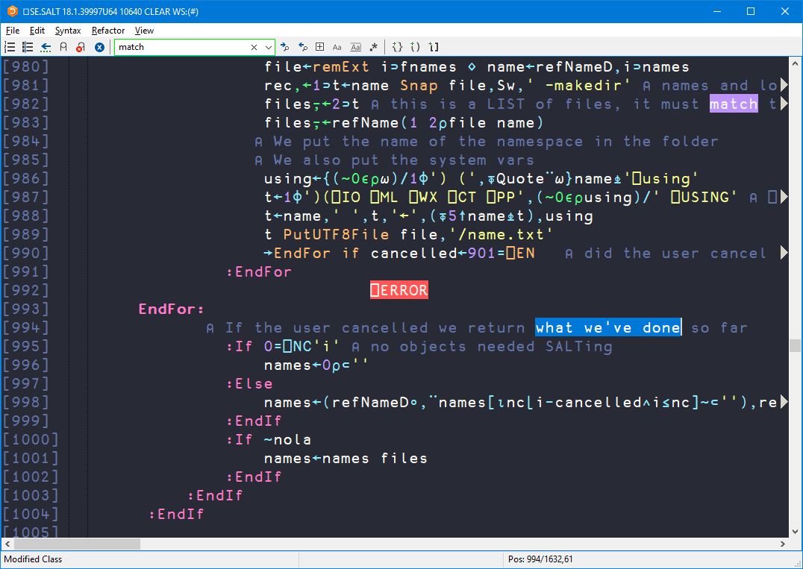
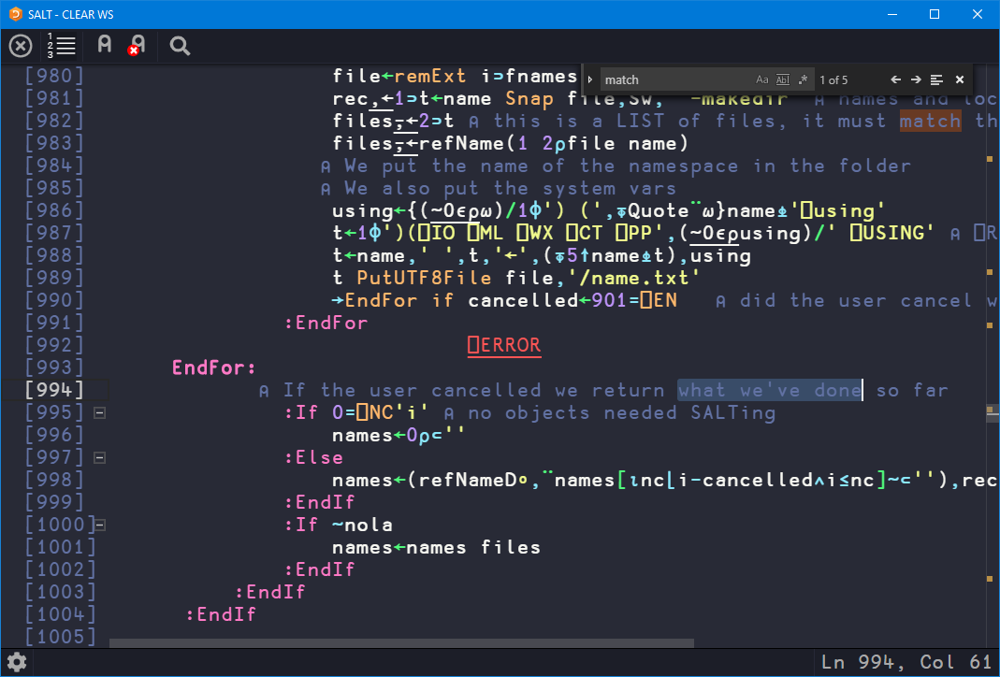

# Dracula for [Dyalog APL](https://dyalog.com)

> A dark theme for [Dyalog APL](https://dyalog.com).

 

## Install

All instructions can be found at [draculatheme.com/dyalog-apl](https://draculatheme.com/dyalog-apl).

## Team

This theme is maintained by the following person and a bunch of [awesome contributors](https://github.com/dracula/template/graphs/contributors).

 |
--- |
[Adám Brudzewsky](https://github.com/abrudz) |

## License

[MIT License](./LICENSE)
